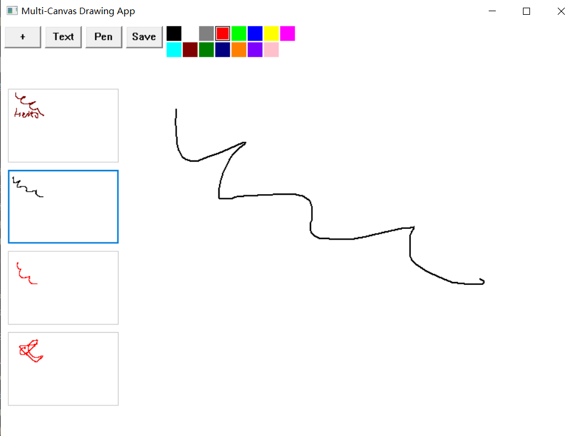

# MiniCanvers

## 概述

这是一个基于 Windows 的简单绘图应用程序，灵感来自于 Microsoft Paint 的实用性和 PowerPoint 的侧边栏功能。使用 Win32 原生 API 构建，它提供了一个轻量级且快速的绘图体验，资源占用少。

## 功能

- **颜色选择器**：轻松切换不同的画笔颜色。
- **文本输入**：在画布上添加文本框。
- **图像拼接**：将多个绘图组合并保存为单个 PNG 图像。
- **剪贴板集成**：
  - `Ctrl + V`：直接将图像粘贴到画布上。
  - `Ctrl + Space`：清除选定区域。
- **侧边栏**：类似于 PowerPoint 的侧边栏，方便访问工具和设置。

## 截图


)


## 安装

1. 克隆仓库：
   ```bash
   [git clone https://github.com/3034337688/MiniCanvers.git]
   ```
2. 在您喜欢的开发环境中打开项目。
3. 构建:
   ```bash
   [g++.exe E:/Desktop/kk/test2.cpp -o E:/Desktop/kk/untitled1.exe -finput-charset=UTF-8 -fexec-charset=gbk -g3 -pipe -Wall -D_DEBUG -DUNICODE -D_UNICODE -mwindows -LE:/Desktop/curl-8.11.0_2-win64-mingw/curl-8.11.0_2-win64-mingw/lib -Wl,--stack,12582912 -LC:\Windows\System32 -lgdi32 -luser32 -lcomctl32 -lcomdlg32 -lgdiplus -lshlwapi -static]
   
   ```
4.注意：把路径替换为文件路径。
5. 使用提供的构建脚本构建项目。

## 使用

1. **启动应用程序**：运行可执行文件以启动绘图画布。
2. **选择工具**：使用侧边栏选择不同的工具，如画笔、文本和颜色选择器。
3. **绘图和输入**：开始在画布上绘图或输入文本。
4. **保存和导出**：使用保存功能将您的工作导出为 PNG 图像。

## 快捷键

- `Ctrl + V`：将图像粘贴到画布上。
- `Ctrl + Space`：清除选定区域。

## 贡献

欢迎贡献！请随时提交拉取请求或打开问题以报告任何错误或功能请求。

## 许可证

本项目基于 MIT 许可证。有关更多详细信息，请参阅 [LICENSE](LICENSE) 文件。

---

由 [别看着我笑了](https://baidu.com) 制作，感谢您的支持！
